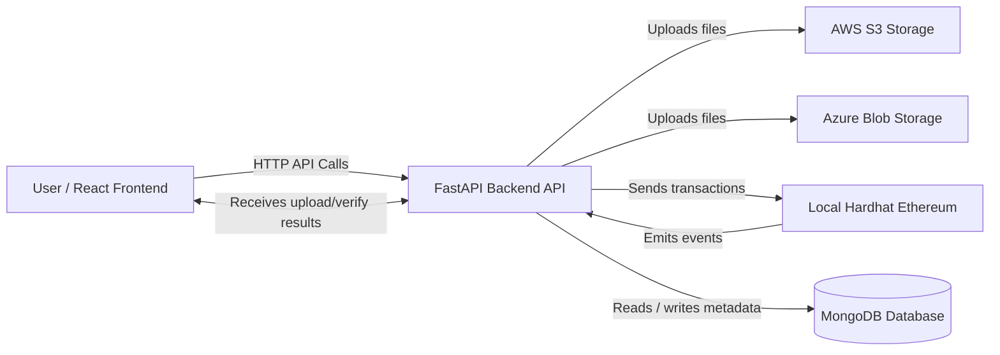
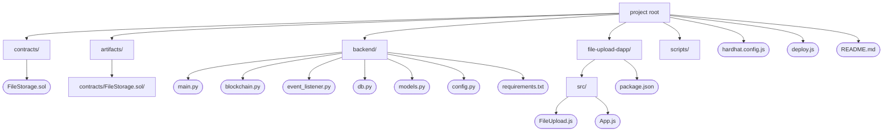
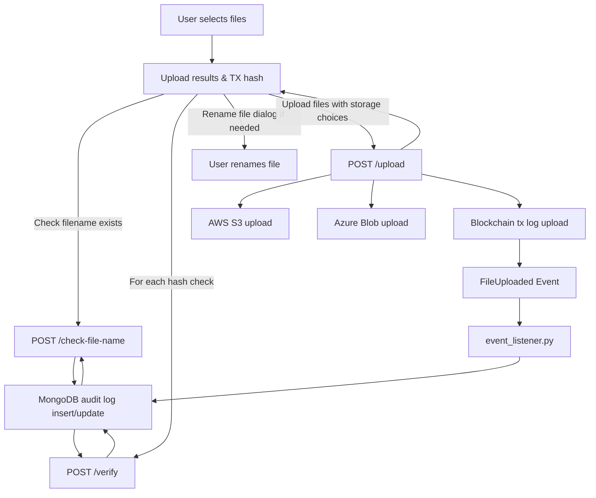
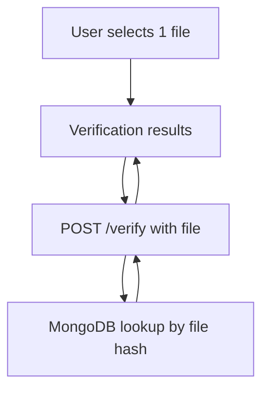

# give me readme.md  including these diagrams with descriptions and explanations.

Here is a comprehensive **README.md** for your blockchain file upload project including the Mermaid diagrams with detailed descriptions and system explanations:

***

# Blockchain File Upload - Secure Multi-Cloud Storage with Immutable Audit Trail

## Project Overview

This project implements a **secure, multi-cloud file storage system** integrated with a blockchain-based immutable audit trail. Users can upload files to AWS S3 and Azure Blob Storage simultaneously. Each upload is logged on a local Hardhat Ethereum testnet via a smart contract, ensuring tamper-proof tracking of file uploads with metadata such as file hash, storage location, uploader info, and block timestamp.

An off-chain MongoDB database indexes blockchain events for efficient querying, duplicate prevention, and file integrity verification. The React frontend provides a user-friendly interface for file selection, upload progress, cloud storage selection, duplicate detection with rename options, and verification of files on the blockchain.

***

## Architecture Overview



*This diagram shows the core components interaction. Users interact via the React frontend that talks to the FastAPI backend. The backend handles uploads to cloud, sends transactions to blockchain, and indexes blockchain event data in MongoDB.*

***

## Project Structure



*This shows the file and folder organization of the project components and source code.*

***

## Data Flow Diagrams

### Upload Flow



*This illustrates the flow from file selection, duplicate checks, rename suggestions, multi-cloud upload, on-chain logging, event listening, and result display.*

***

### Verification Flow



*This shows how file hash verification interacts with backend and database to confirm presence on blockchain.*

***

## Features

- Upload files to **AWS S3** and/or **Azure Blob Storage**.
- Immutably log file uploads on the **Ethereum Hardhat testnet** blockchain.
- Store file hash, uploader, storage backends, timestamp, and tx hash on-chain and off-chain.
- Prevent duplicate uploads by checking filename and hash before upload.
- Prompt user to rename files if duplicates with different content exist.
- Verify file hash integrity against on-chain metadata.
- User-friendly React UI with progress bars, detailed results, and blockchain explorer links.

***

## Technology Stack

| Layer | Technology / Framework |
| :-- | :-- |
| Blockchain (Smart Contract) | Solidity, Hardhat (local testnet) |
| Backend API | Python, FastAPI, Web3.py |
| Database | MongoDB (Motor async driver) |
| Cloud Storage | AWS S3, Azure Blob Storage |
| Frontend UI | React.js, Material-UI |
| Deployment \& Tooling | Node.js, Hardhat, Python venv |


***

## Setup \& Usage (Summary)

1. Run Hardhat local testnet:

```bash
npx hardhat node
npx hardhat compile
npx hardhat run scripts/deploy.js --network localhost
```

2. Setup Python backend:

```bash
python -m venv venv
source venv/bin/activate  # or venv\Scripts\activate on Windows
pip install -r backend/requirements.txt
uvicorn backend.main:app --reload
python backend/event_listener.py
```

3. Launch frontend React app:

```bash
cd file-upload-dapp
npm install
npm start
```

4. Configure `.env` with your MongoDB URI, AWS, Azure, blockchain addresses and keys.

***

## Contribution \& Roadmap

- Add user authentication \& upload permissions.
- Extend audit logging with batch reporting and historical queries.
- Support additional decentralized storage backends (e.g., IPFS).
- Enhance UI with detailed audit log filters and export features.

